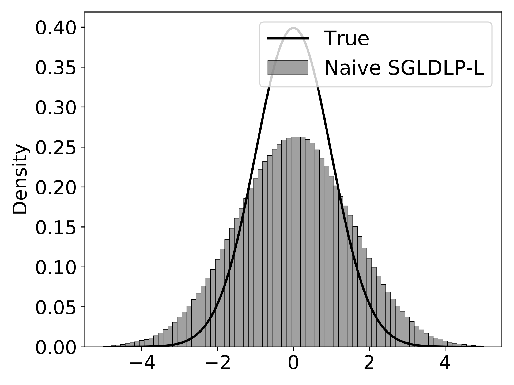
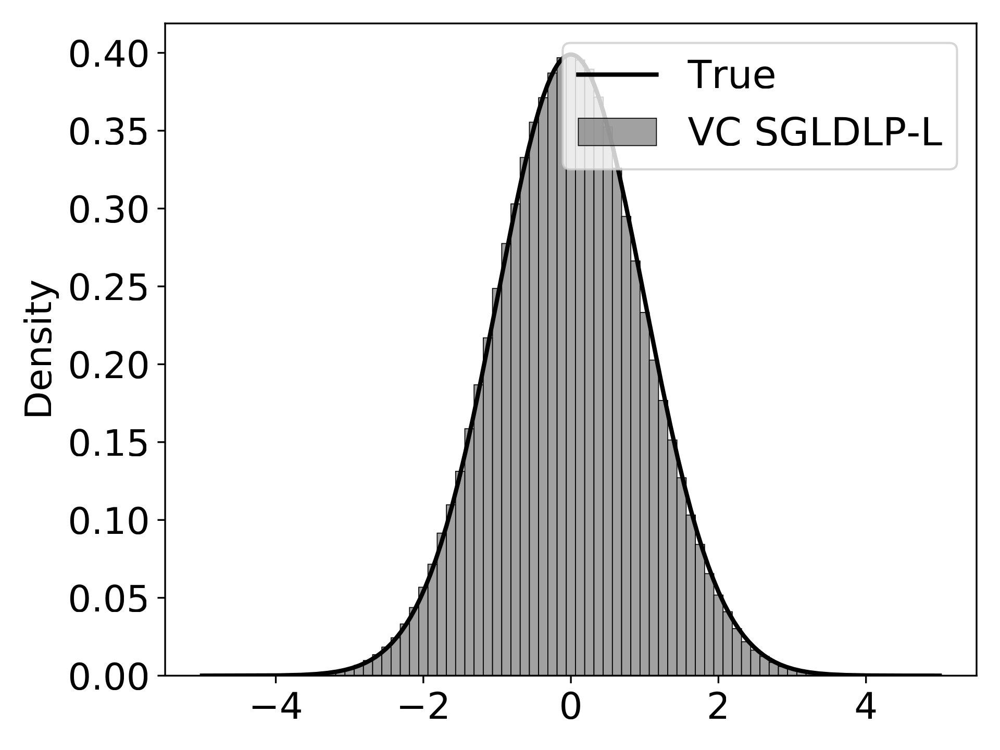
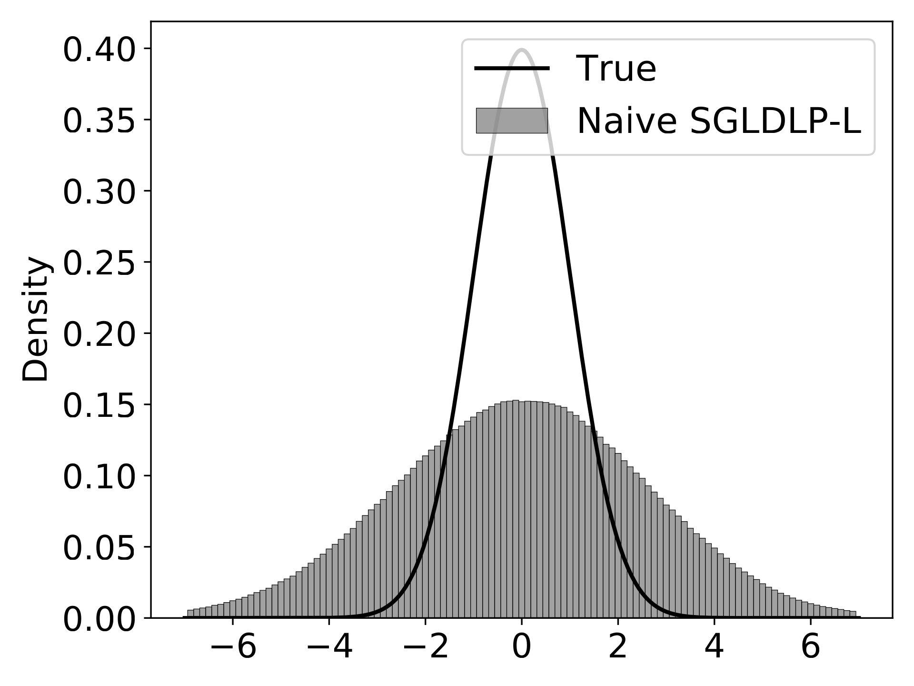
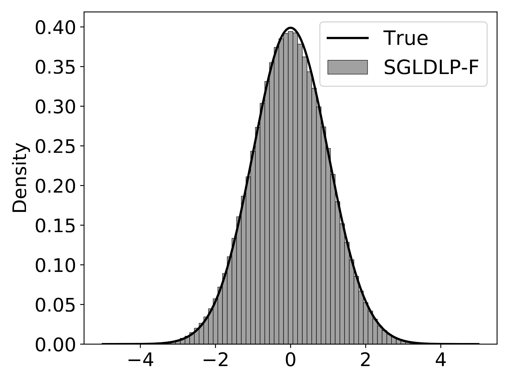

(chap:sampling_methods_low_precision_sampling)=
# Low-precision sampling

+++
When running simulations for a dynamic system on a computer, the impact of round-off errors on number representations (e.g., floating-point representations) can not be naively presumed to be negligible. It has been observed that a large deviation can occur between numerical behavior and the theoretical behaviour {cite:p}`guiheneuf2015dynamical`. In Bayesian literature, the same question arises: how does the rounding error from computer simulation affect the convergence property of a Markov chain? {cite:t}`roberts1998convergence` shows a rather alarming example that a well-behaved Markov chain (with Feller continuity and geometrical ergodicity) becomes transient (i.e., will not converge to any target distribution) after adding an arbitrarily small roundoff error. {cite:t}`hoffmanroundoff` also warned that roundoff errors can severely degrade the performance of the Metropolis-Hastings sampling algorithm. To sum up, a common wisdom for conventional MCMC practice is to utilize high-precision numerical representations to limit the negative impact of roundoff errors. However, in this chapter, we will embrace the low-precision representations in the era of SG-MCMC samplers.

+++
## Low-Precision Deep Neural Network

The rise of large-scale deep neural networks (DNNs) and large language models (LLMs) has led to significant computational and memory costs of model training and inference. To improve efficiency, low-precision deep learning {cite:p}`hubara2016binarized,jacob2018quantization,rastegari2016xnor,zhang2018lq,zhou2016dorefa,li2017training` — which uses fewer bits to represent values of model parameters, activations, and gradients, and thus can substantially lower resource demands — has emerged as a promising direction. Precision formats such as 16-bit (FP16), 8-bit (INT8), 4-bit, and even binary (1-bit) offer memory reduction, energy savings, and speedup in inference, enabling deployment on edge devices and platforms, and specialized accelerators. On the other hand, well-designed low-precision optimization algorithms can maintain the model utility, such that the performance degradation from full-precision models to low-precision models is tolerable.

Modern foundations of low-precision deep learning include {cite:t}`gupta2015deep`, which leverages 16-bit wide fixed-point arithmetic and stochastic rounding to accelerate the training speed of DNNs, and {cite:t}`vanhoucke2011improving`, which discusses the possibility of running DNN inference on x86 CPUs rather than GPUs using 8-bit fixed-point arithmetic. In general, there are two directions for achieving lower precision representations of DNN models: quantization-aware training (QAT) and post-training quantization (PTQ). The former simulates quantization during the training process, allowing the model to learn a robust solution that accounts for quantization errors induced by rounding; the latter, on the other hand, applies quantization to off-the-shelf pre-trained models. It is arguably true that QAT outperforms PTQ in terms of better accuracy, but incurs greater computational costs of model training. Other worth mentioning techniques of low-precision models are, but not limited to, non-uniform quantization and mixed precision training. Opposite to conventional quantization methods that map floating point values to an evenly spaced quantized target space, non-uniform quantization chooses an unevenly spaced quantized target space that can allocate more quantization levels where the values are dense. This unevenly spaced quantized target space can be of logarithmic scale {cite:p}`miyashita2016convolutional`, or adaptively learned from the training process {cite:p}`zhang2018lq`. Mixed-precision methods {cite:p}`dong2019hawq,micikevicius2017mixed` assign different bit-widths to different layers of the neural networks or different computation steps of the training, leveraging the fact that different components of DNNs have varying sensitivities to quantization error. Theoretical investigations related to low-precision training are available in {cite:t}`li2017training,de2018high,sakr2019accumulation,markov2023quantized`.

Inevitably, low-precision optimization achieves better efficiency at the expense of performance sacrifice. One natural way to mitigate performance degradation caused by quantization error is low-precision Bayesian sampling. We argue that posterior sampling is particularly suited for low-precision arithmetic because of its inherent robustness to system noise. In particular: (1) Bayesian posterior explores plausible weight space instead of converging to a single point, thus it should not require precise weights and be tolerant to non-full-precision models; and (2) it allows us to perform model averaging during inference using an ensemble of models sampled from the posterior, which compensates for the performance drop caused by coarse representations of individual models {cite:p}`zhu2019binary`.

+++
(ch5:section:sgmcmc)=
## Low-Precision SG-MCMC

### Preliminary

The Bayesian counterpart of QAT directly samples low-precision models (i.e., low-precision weights of the neural network) from a target distribution (typically, a Bayesian posterior distribution). A straightforward idea is to adapt existing Monte Carlo sampling algorithms for low-precision sampling tasks. In the regime of deep learning, where the training data sets are usually massive, the SG-MCMC sampling algorithm (see Chapter [](#chap:sampling_methods_sg_mcmc)) is the most suitable choice since it can avoid a full scan of the data set when calculating the likelihood terms.

Now we briefly recall two seminal SG-MCMC algorithms, the SGLD and SGHMC. Given a dataset {math}`\mathcal D`, a statistical model with parameters {math}`\theta\in \mathbb{R}^P`, and a prior {math}`p(\theta)`, we aim to sample from the posterior {math}`p(\theta| \mathcal D)\propto \exp( -U(\theta ))`, where the energy function is defined as

```{math}
U(\theta) = -\sum_{(x,y)\in\mathcal D}\log p(x,y|\theta)-\log p(\theta).
```

Stochastic Gradient Langevin Dynamics (SGLD) updates the parameter in the {math}`(k+1)`-th step following the rule

```{math}
:label: ch5:eq:sgld-update

\begin{align}
    \theta_{k+1} = \theta_{k} -\alpha\nabla\tilde{U}(\theta_{k}) + \sqrt{2\alpha}\xi_{k+1},
\end{align}
```

where {math}`\alpha` is the stepsize, {math}`\xi_{k+1}` is standard Gaussian noise, and the stochastic gradient {math}`\nabla\tilde U` is an unbiased estimator of {math}`\nabla U` based on a subset of the dataset {math}`\mathcal D`. The use of stochastic gradients helps reduce the computational cost. Compared to the Stochastic Gradient Descent (SGD) update, the only difference is that SGLD adds an additional Gaussian perturbation at each step, enabling SGLD to characterize the full distribution rather than converge to a single point. Due to this close connection, it is convenient to implement SGLD on existing deep learning tasks for which SGD is the default learning algorithm.

Stochastic Gradient HMC {cite:p}`chen2014stochastic` is derived by replacing {math}`\nabla U` with a noisy gradient {math}`\nabla \tilde U+\xi` in the Hamiltonian Monte Carlo, and boils down to the unadjusted underdamped Langevin algorithm with stochastic gradient, where the underdamped Langevin dynamics can be defined as

```{math}
:label: ch5:eq:underdamped

\begin{split}
       \,\mathrm{d} v_t &= -\gamma v_t \,\mathrm{d} t - u \nabla U(\theta_t) \,\mathrm{d} t + \sqrt{2\gamma u} \,\mathrm{d} \mathbf{B}_t \\
     \,\mathrm{d} \theta_t &= v_t\,\mathrm{d} t,
    
\end{split}
```

where {math}`u`, {math}`\gamma` denote the hyperparameters of the inverse mass and friction, respectively. Furthermore, {cite:t}`cheng2018underdamped` proposed the following discretization of underdamped Langevin dynamics [](#ch5:eq:underdamped) with stochastic gradient:

```{math}
:label: ch5:eq:sghmc

\begin{align}
    v_{k+1} &= v_{k}e^{-\gamma\eta} - u\gamma^{-1}(1-e^{-\gamma\eta}){\nabla \tilde U}(\theta_k) + \xi_{k}^{v} \\
    \nonumber \theta_{k+1} &= \theta_k + \gamma^{-1}(1-e^{-\gamma\eta}) v_k+u\gamma^{-2}(\gamma\eta+e^{-\gamma\eta}-1){\nabla \tilde U}(\theta_k)+\mathbf{\xi}_{k}^{\theta},
\end{align}
```

where {math}`\mathbf{\xi}_{k}^{v}`, {math}`\mathbf{\xi}_{k}^{\theta}` are normal distributed in {math}`\mathbb{R}^P` satisfying that :

```{math}
:label: ch5:eq:sghmc-noise

\begin{align}
    \nonumber \mathbb{E} \mathbf{\xi}_k^{v}(\mathbf{\xi}_k^{v})^\intercal &= u(1-e^{-2\gamma\eta}) \cdot \mathbf{I},\\
    \mathbb{E}\mathbf{\xi}_k^{\theta}(\mathbf{\xi}_k^{\theta})^\intercal &= u\gamma^{-2}(2\gamma\eta+4e^{-\gamma\eta}-e^{-2\gamma\eta}-3) \cdot \mathbf{I},     \\
    \nonumber \mathbb{E} \mathbf{\xi}_k^{\theta}(\mathbf{\xi}_k^{v})^\intercal &= u\gamma^{-1}(1-2e^{-\gamma\eta}+e^{-2\gamma\eta}) \cdot \mathbf{I}.
\end{align}
```

Before formally introducing the low-precision SG-MCMC algorithms, we review the basic concepts of low-precision training. To represent numbers, e.g., the weights of a DNN, in low-precision, one simple way is to use *fixed-point* representation, which has been utilized in both theory and practice {cite:p}`gupta2015deep,li2017training,yang2019swalp`. Specifically, suppose that we use {math}`W` bits to represent a number, where {math}`F` of those {math}`W` bits are used to represent the fractional part. Then, there is a gap between consecutive representable numbers, {math}`\Delta=2^{-F}`, which is called* quantization gap*. In addition, the representable numbers also have a lower bound {math}`L= -2^{W-F-1}` and an upper bound {math}`U = 2^{W-F-1}-2^{-F}`. Therefore, when the number of bits (i.e., {math}`W` and {math}`F`) decreases, the accuracy and range of number representation decreases. This chapter will use this type of number representation in our theoretical analysis and empirical demonstration, following existing literature {cite:p}`li2017training,yang2019swalp`.

Another popular number representation is *floating point*, where each number is decomposed into its own sign, exponent, and significand (or mantissa). Between fixed point and floating point,* block floating point* allows numbers within a block to share a common exponent {cite:p}`song2018computation`. This chapter will also present some deep learning experiments using block floating point for deep learning experiments since it has been shown to be more favourable for deep models {cite:p}`yang2019swalp`.

Given the low-precision number representations, we also need a quantization function (or a quantizer) {math}`Q` which converts a real-valued number into a low-precision number. Popular choices include *deterministic rounding* and* stochastic rounding*. More specifically, the deterministic rounding function {math}`Q^d` quantizes a number to its nearest representable neighbour, i.e.,

```{math}
Q^d(\theta) = \text{sign}(\theta)\cdot \text{clip}\left(\Delta\left\lfloor\frac{|{\theta}|}{\Delta}+\frac{1}{2}\right\rfloor, L, U\right),
```

where {math}`\text{clip}(x,L,U) = \max[\min(x,U),L]` and the above operator is applied to the whole vector elementwisely. On the other hand, stochastic rounding {math}`Q^s` quantizes a number to one of its representable neighbours based on a probabilistic rule:

```{math}
\begin{align*}
Q^s(\theta) =
    \begin{cases}
      \text{clip}\left(\Delta\left\lfloor\frac{\theta}{\Delta}\right\rfloor, L, U\right), &\text{w.p. } \left\lceil\frac{\theta}{\Delta}\right\rceil -  \frac{\theta}{\Delta} \\
      \text{clip}\left(\Delta\left\lceil\frac{\theta}{\Delta}\right\rceil, L, U\right), &\text{w.p. } 1-\left(\left\lceil\frac{\theta}{\Delta}\right\rceil -  \frac{\theta}{\Delta}\right).
    \end{cases}
\end{align*}
```

A key design property of {math}`Q^s` is that {math}`\mathbb{E}\left[Q^s(\theta)\right]=\theta`, meaning the quantized number is unbiased. {math}`Q^s` is generally preferred over {math}`Q^d` in practice since it can preserve gradient information, especially when the scale of the gradient update is smaller than the quantization gap (which is always quantized to 0 if {math}`Q_d` is implemented) {cite:p}`gupta2015deep,wang2018training`. In what follows, we utilize stochastic rounding as our quantizer, and when necessary, {math}`Q_W` and {math}`\Delta_W` denote the weights’ quantizer and quantization gap, {math}`Q_G` and {math}`\Delta_G` denote gradients’ quantizer and quantization gap.

To perform a gradient update in low-precision presentations, there are two common strategies depending on whether we keep an additional copy of full-precision weights. The SGD with *Full-precision gradient accumulators* (SGDLP-F) algorithm uses a full-precision weight buffer to accumulate gradient updates and only quantizes weights before computing gradients. Particularly, it updates the weights as follows,

```{math}
\theta_{k+1} = \theta_{k} - \alpha Q_G\left(\nabla\tilde{U}(Q_W\left(\theta_{k})\right)\right),
```

where {math}`\theta_{k+1}` and {math}`\theta_k` are full-precision during the update, and the gradient computation is quantized for forward and backward propagation {cite:p}`courbariaux2015binaryconnect,li2017training`.

Gradient accumulators need to be frequently updated during training. Hence, to further reduce the computational costs, *low-precision gradient accumulators* represent them in low-precision format, and SGD with low-precision gradient accumulators (SGDLP-L) performs the update as follows,

```{math}
:label: ch5:eq:sgdlp-l

\begin{align}
    \theta_{k+1} = Q_W\left(\theta_{k} - \alpha Q_G\left(\nabla\tilde{U}(\theta_{k})\right)\right),
\end{align}
```

where {math}`\theta` is always represented in low precision. In comparison, low-precision gradient accumulators are cheaper and faster due to having all numbers in low precision, whereas full-precision gradient accumulators better preserve small gradient updates, leading to better performance in general {cite:p}`courbariaux2015binaryconnect,li2017training`.

### Low-Precision Stochastic Gradient Langevin Dynamics

In this section, we combine the low-precision rounding and the SGLD update ([2](#ch5:eq:sgld-update)). As shown in Equation [](#ch5:eq:sgld-update), the update of a full-precision SGLD is simply a full-precision SGD update plus a Gaussian noise. Therefore, the low-precision counterpart of SGLD is naturally the low-precision SGLD training with an additional Gaussian noise in each step. Given the SGDLP-F, we can do low-precision SGLD with full-precision gradient accumulators (SGLDLP-F) as follows:

```{math}
:label: ch5:eq:highacc

\begin{align}
    \theta_{k+1} = \theta_{k} - \alpha Q_G\left(\nabla\tilde{U}(Q_W\left(\theta_{k})\right)\right) + \sqrt{2\alpha}\xi_{k+1}.
\end{align}
```

Despite this small change, the Gaussian noise turns out to help counteract the rounding noise introduced by quantization, which makes SGLDLP-F more robust to inaccurate number representation and converges better than SGDLP-F as shown in [](#ch5:thm:highacc).

To facilitate the theoretical analysis, we assume that the target distribution is smooth and strongly log-concave, and the energy function has a Lipschitz Hessian, i.e., {math}`\forall~ \theta,\theta'\in \mathbb{R}^P`,

```{math}
:label: ch5:eq:assumptions

\begin{split}
      &U(\theta) - U(\theta') - \nabla U(\theta')^\intercal (\theta - \theta') \ge (m/2) \left\lVert \theta - \theta' \right\rVert_2^2,   \\
      &\left\lVert \nabla U(\theta) - \nabla U(\theta') \right\rVert_2 \le M \left\lVert \theta - \theta' \right\rVert_2,  \\
      &\| \nabla^2 U(\theta) - \nabla^2 U(\theta') \|_2 \le \Psi \| \theta - \theta' \|_2,\\
      &\mathbb{E}\left[\| \nabla\tilde{U}(\theta) - \nabla U(\theta) \|_2^2 \right]\le \kappa^2.
      \end{split}
```

These assumptions are commonly used in the literature {cite:p}`dalalyan2019user,yang2019swalp,zhang2022low,wang2023enhancing`.

:::{prf:theorem}
:label: ch5:thm:highacc

+++
We run SGLDLP-F under the above assumptions and with a constant stepsize {math}`\alpha \le 2/(m+M)`. Let {math}`\pi` be the target distribution, {math}`\mu_0` be the initial distribution and {math}`\mu_K` be the distribution obtained by SGLDLP-F after {math}`K` iterations, then the 2-Wasserstein distance is

```{math}
\begin{align*}
    W_2(\mu_K, \pi)&\le (1-\alpha m)^KW_2(\mu_0, \pi) + 1.65 (M/m)(\alpha P)^{1/2}\\
    & + \min\left( \frac{ \Psi \Delta_W^2 P }{4m}, \frac{M \Delta_W \sqrt{P}}{2 m} \right) + \sqrt{\frac{(\Delta_G^2 + M^2 \Delta_W^2)\alpha P + 4\alpha \kappa^2}{4m}}.
\end{align*}
```
:::

+++
This theorem shows that SGLDLP-F converges to the accuracy floor at

```{math}
\min\left( \frac{ \Psi \Delta_W^2 P }{4m}, \frac{M \Delta_W \sqrt{P}}{2 m} \right)
```

given a large iteration number {math}`K` and small stepsize {math}`\alpha`. Furthermore, if {math}`\Psi=0` (i.e., the energy function is quadratic), then SGLDLP-F indeed converges to the target distribution asymptotically. This is comparable to the optimization result that SGDLP-F converges to the optimum asymptotically on a quadratic loss{cite:p}`li2017training`. This theorem also recovers the bound of full-precision SGLD (i.e., {math}`\Delta_W=0`) presented by {cite:t}`dalalyan2019user`. In general, when the energy function is not exactly quadratic, the convergence of SGLDLP-F to the target distribution has a {math}`\mathcal{O}(\Delta_W^2)` rate, but SGDLP-F to the global optimum has a {math}`\mathcal{O}(\Delta_W)` rate {cite:p}`yang2019swalp`. Because {math}`\Delta_W = 2^{-F}` where {math}`F` is the number of fractional bits, it implies that to achieve the same convergence accuracy, SGLD only needs half the number of fractional bits as SGD needs. This advantage of SGLD over SGD fits into the literature of comparing sampling and optimization convergence bounds {cite:p}`ma2019sampling,talwar2019computational`.

To further reduce the computational costs, we can utilize low-precision gradient accumulators and mimic the update of SGDLP-L in Equation [](#ch5:eq:sgdlp-l). Naturally, this leads to the following update rule of SGLD with low-precision gradient accumulators (SGLDLP-L),

```{math}
:label: ch5:eq:lowacc

\begin{align}
    \theta_{k+1} = Q_W\left(\theta_{k} - \alpha Q_G\left(\nabla\tilde{U}(\theta_{k})\right) + \sqrt{2\alpha }\xi_{k+1}\right).
\end{align}
```

Unfortunately, unlike the convergence behaviour of SGLDLP-F, SGLDLP-L may diverge arbitrarily far away from the target distribution with a small stepsize.

:::{prf:theorem}
:label: ch5:thm:lowacc

+++
We run SGLDLP-L under the same assumptions as in [](#ch5:thm:highacc). Let {math}`\mu_0` be the initial distribution and {math}`\mu_K` be the distribution obtained by SGLDLP-L after {math}`K` iterations, then

```{math}
:label: ch5:eq:w2lpl

\begin{split}
    W_2(\mu_K, \pi)&\le (1-\alpha m)^KW_2(\mu_0, \pi) + 1.65 (M/m)(\alpha P)^{1/2}  + \min\left( \frac{ \Psi \Delta_W^2 P }{4m}, \frac{M \Delta_W \sqrt{P}}{2 m} \right)\\
&+ \sqrt{\frac{(\alpha \Delta_G^2 + \alpha ^{-1} \Delta_W^2) P + 4\alpha \kappa^2}{4m}}+ \left((1-\alpha m)^K + 1\right)\frac{\Delta_W \sqrt{P}}{2}.
\end{split}
```
:::

+++
Note that an {math}`\alpha^{-1}` factor appears in one term on the right-hand side upper bound; this theorem implies that as the stepsize {math}`\alpha` of SGLDLP-L decreases, {math}`W_2` distance between the actual sampling distribution and the target distribution may increase. To empirically verify it, we run SGLDLP-L on a standard Gaussian distribution in Figure [](#ch5:fig:gaussian) with the stepsize {math}`\alpha=0.001` and 0.0001. The experiment uses 8-bit fixed-point, and 3 out of 8 bits are used to represent the fractional part. The simulations clearly demonstrate that SGLDLP-L diverges farther away from the target distribution under a smaller stepsize, whereas SGLDLP-F samples always successfully resemble the target distribution, aligning with the result in [](#ch5:thm:highacc).

:::{figure}
:label: ch5:fig:gaussian











Low-precision SGLD with varying stepsizes on a normal distribution. Variance-corrected SGLD with low-precision gradient accumulators (VC SGLDLP-L) and SGLD with full-precision gradient accumulators (SGLDLP-F) converge to the true distribution, whereas na\"ive SGLDLP-L diverges and the divergence increases as the stepsize decreases.
:::

+++
One possible remedy is to choose a stepsize that minimizes the right handed side of [](#ch5:eq:w2lpl). However, this is not feasible in practice since the constants (such as {math}`M` and {math}`m`) are general unknown. Moreover, enabling a small stepsize in SGLD is usually desirable, since a smaller stepsize helps reduce the asymptotic bias of the posterior approximation {cite:p}`welling2011bayesian`.

One key reason causing the divergence of SGLDLP-L is that the *variance* of each dimension of {math}`\theta_{k+1}` becomes larger due to using low-precision gradient accumulators. More precisely, given the stochastic gradient {math}`\nabla\tilde{U}`, the update of full-precision SGLD is equivalent to sampling from a Gaussian distribution

```{math}
\theta_{k+1,i}\sim\mathcal{N}\left(\theta_{k,i} - \alpha  \nabla\tilde{U}(\theta_{k})_i, 2\alpha \right), \text{for each dimension } i=1,\cdots, P.
```

Note that both the weight quantizer {math}`Q_W` and the gradient quantizer {math}`Q_G` are unbiased stochastic rounding, hence SGLDLP-L satisfies

```{math}
\begin{align*}
    \mathbb{E}\theta_{k+1,i} &= \mathbb{E} Q_W\left(\theta_{k,i} - \alpha Q_G\left(\nabla\tilde{U}(\theta_{k})\right)_i + \sqrt{2\alpha }\xi_{k+1,i}\right)
    =\theta_{k,i} - \alpha \nabla\tilde{U}(\theta_{k})_i,
\end{align*}
```

which shares the same mean as {math}`\theta_{k+1}` in full-precision. But on the other hand, the variance of {math}`\theta_{k+1,i}` is now larger than needed. Let’s ignore the variance caused by {math}`Q_G` and the stochastic gradient (since they are present and have been shown to work well in SGLDLP-F), then the variance of {math}`\theta_{k+1,i}` is

```{math}
\begin{align*}
    &\mbox{Var}(\theta_{k+1,i})\\ 
    &=\mathbb{E}\left[\mbox{Var}\left[Q_W\left(\theta_{k,i} - \alpha \nabla U(\theta_{k})_i + \sqrt{2\alpha }\xi_{k+1,i}\right)\middle|\xi_{k+1,i}\right]\right]\\
    &\hspace{0em}+ \mbox{Var}\left[\mathbb{E}\left[Q_W\left(\theta_{k,i} - \alpha \nabla U(\theta_{k})_i + \sqrt{2\alpha }\xi_{k+1,i}\right)\middle|\xi_{k+1,i}\right]\right]\\
    &=\frac{ \Delta_W^2}{4} \chi_{k+1,i} + 2\alpha,
\end{align*}
```

for some {math}`\chi_{k+1,i}\in [0,1]`. This result shows that the variance of the SGLDLP-L update is larger than the ideal variance value {math}`2\alpha`. Figure [](#ch5:fig:gaussian) also reflects this, as the naive SGLDLP-L estimates the mean correctly but the variance wrongly.

To correct the inflated variance and enable SGLD with low-precision gradient accumulators, {cite:t}`zhang2022low` introduced a new variance-corrected quantization function {math}`Q^{\text{vc}}`. The main idea of {math}`Q^{\text{vc}}` is to directly sample from the discrete low-precision space instead of quantizing a real-valued Gaussian sample. To begin with, if we want a sample over {math}`\{\Delta_W,-\Delta_W,0\}` with mean {math}`\mu\ge 0` and variance {math}`v\le\Delta^2_W /4`, we could sample it with the following categorical distribution,

```{math}
:label: ch5:eq:categorical

\begin{align}
\text{Cat}(\mu,v)=
\begin{cases}
      \Delta_W, &  w.p.  \frac{v+\mu^2+\mu\Delta_W}{2\Delta_W^2}\\
      -\Delta_W, & w.p.  \frac{v+\mu^2-\mu\Delta_W}{2\Delta_W^2} \text{\hspace{1em} }\\ 
      0, & \text{otherwise}
    \end{cases}
\end{align}
```

providing that the probability values are valid (i.e., non-negative and smaller than 1). To use this categorical distribution to preserve the correct mean and variance for quantized {math}`\theta_{k+1}`, we consider two cases: (i) when the ideal variance {math}`2\alpha` is larger than the largest possible stochastic rounding variance, i.e., {math}`\Delta_W^2/4`, {math}`Q^{\text{vc}}` first adds a small Gaussian noise and uses the sampler in Equation [](#ch5:eq:categorical) to make up the remaining variance; (ii) Otherwise, {math}`Q^{\text{vc}}` directly samples from Equation [](#ch5:eq:categorical) to achieve the target variance. The full description of {math}`Q^{\text{vc}}` is described in [](#ch5:alg:vc). It is not difficult to see that the use of {math}`\text{Cat}(\cdot,\cdot)` sampler is valid in [](#ch5:alg:vc), with the sampling probabilities being nonnegative. This variance-corrected quantizer leads to the following SGLDLP-L algorithm, named VC SGLDLP-L:

```{math}
:label: ch5:alg:vcsgld

\theta_{k+1} = Q^{\text{vc}}\left(\theta_{k} - \alpha Q_G\left(\nabla\tilde{U}(\theta_{k})\right), 2\alpha, \Delta_W\right).
```

:::{prf:algorithm} Variance-Corrected Quantization Function $Q^{\text{vc}}$.
:label: ch5:alg:vc

- **Inputs:** {math}`(\mu, v, \Delta)`
- **Output:** {math}`\theta\in\mathbb{R}^P` with mean vector {math}`\mu\in\mathbb{R}^P` and coordinate variance {math}`v\in\mathbb{R}`
1. {math}`v_0 \gets \Delta^2/4` — *Note:* {math}`\Delta^2/4` is the largest variance due to stochastic rounding
1. **If** {math}`v > v_0`:
    1. {math}`x \gets \mu + \sqrt{v - v_0}\,\xi`, where {math}`\xi \sim \mathcal N(0, I_P)`
    1. {math}`r \gets x - Q^d(x)`
    1. **For each** {math}`i`:
        1. \textbf{sample} {math}`c_i` from {math}`\mathrm{Cat}(|r_i|, v_0)` as in Equation [](#ch5:eq:categorical)
        *Note:* {math}`c_i`, {math}`r_i` and {math}`\theta_i` are {math}`i`th coordinates of {math}`c`, {math}`r` and {math}`\theta`, respectively
    1. {math}`\theta \gets Q^d(x) + \operatorname{sign}(r)\odot c`
1. **Else:**
    1. {math}`r \gets \mu - Q^s(\mu)`
    1. **For each** {math}`i`:
        1. {math}`v_s \gets \left(1-\frac{|r_i|}{\Delta}\right) r_i^2 + \frac{|r_i|}{\Delta}\left(-r_i+\mbox{sign}(r_i)\Delta\right)^2`
        1. **If** {math}`v > v_s`:
            1. \textbf{sample} {math}`c_i` from {math}`\mathrm{Cat}(0,\, v - v_s)` as in Equation [](#ch5:eq:categorical)
            1. {math}`\theta_i \gets Q^s(\mu)_i + c_i`
        1. **Else:**
            1. {math}`\theta_i \gets Q^s(\mu)_i`
1. \textbf{clip} {math}`\theta` if outside representable range
1. **Return** {math}`\theta`
:::

+++
The variance-corrected quantizer {math}`Q^{\text{vc}}` always guarantees the correct mean, {math}`\mathbb{E}(\theta_{k+1,i})= \theta_{k,i} - \alpha\nabla\tilde U(\theta_k)_i`, and further ensures the variance {math}`\mbox{Var}(\theta_{k+1,i})` matches the ideal value {math}`2\alpha` most of the time except when {math}`v=2\alpha<v_s`, where {math}`v_s` is defined in [](#ch5:alg:vc). We argue that {math}`v=2\alpha<v_s` rarely happens in practice since the stepsize is often very small. Although {math}`Q^{\text{vc}}` only preserves the correctness of the first two moments (i.e., mean and variance), it is sufficient to achieve satisfactory performance in both theory and practice, as shown by [](#ch5:thm:correction) and later numerical evidence.

:::{prf:theorem}
:label: ch5:thm:correction

+++
We run VC SGLDLP-L as in [](#ch5:alg:vcsgld). Besides the same assumptions in [](#ch5:thm:highacc), we further assume the gradient is bounded {math}`\mathbb{E}\left[\left\lVert Q_{G}(\nabla\tilde{U}(\theta_k)) \right\rVert_1\right]\le G`. Let {math}`v_0 = \Delta_W^2/4`. Then

```{math}
\begin{align*}
    W_2(\mu_K, \pi)&\le (1-\alpha m)^KW_2(\mu_0, \pi) + 1.65 (M/m)(\alpha P)^{1/2} \\&\hspace{-4em}+ \min\left( \frac{\Psi A}{m}, \frac{M\sqrt{A}}{m} \right) 
    + \sqrt{\frac{\alpha \Delta_G^2 P +  4\alpha \kappa^2}{4m} + \frac{A}{\alpha m}} + \left((1-\alpha m)^K+1\right)\sqrt{A},
\end{align*}
```

where {math}`A = \begin{cases}
      5 v_0 P, &  \text{if }2\alpha > v_0\\
      \max\left(2\Delta_W\alpha G, 4\alpha P\right), & \text{otherwise}
    \end{cases}`
:::

+++
As shown by this theorem, when the stepsize {math}`\alpha \rightarrow 0`, the distance between the sampling distribution of VC SGLDLP-L and the target distribution no longer diverges to infinity. Instead, under proper choices of {math}`\alpha` and {math}`K`, VC SGLDLP-L converges to the target distribution in {math}`\mathcal{O}(\sqrt{\Delta_W})`, which matches the convergence rate of SGD with low-precision gradient accumulators to the optimum {cite:p}`li2017training,yang2019swalp`.

### **Numerical Experiments**

Now we present some numerical results for these Langevin-based low-precision sampling algorithms. We evaluate the generalization accuracy and uncertainty estimation of SGLDLP-F and variance-corrected VC SGLDLP-L on the ResNet-18 model on the CIFAR datasets {cite:p}`krizhevsky2009cifar10,krizhevsky2009learning`. We use the same quantization for weights, gradients, activations, and backpropagation errors unless otherwise stated. By default, SGLD algorithms collect samples from the approximated posterior of the model’s weights and predict labels for test data via Bayesian model averaging. The comparison baseline is the performance of low-precision SGD, which is commonly used for frequentist low-precision deep learning {cite:p}`sun2019hybrid,sun2020ultra`. We use SGDFP, SGDLP-F, and SGDLP-L to denote full-precision SGD, low-precision SGD with full-precision gradient accumulators, and low-precision SGD with low-precision gradient accumulators, respectively. Both fixed-point and block-floating-point (BFP) low-precision formats are implemented. The numerical results are provided in Table [1](#ch5:tab:1), which reports average performance over 3 runs with the standard error.

:::{list-table} Test Error and ECE on CIFAR dataset with the ResNet-18 model.
:header-rows: 0
:name: ch5:tab:1
:align: center

*   *

    *   Test Errors (%)

    *   ECE 

        {math}`\downarrow`

        (%)

*   *

    *   CIFAR-10

    *   CIFAR-100

    *   CIFAR-10

    *   CIFAR-100

*   *   32-bit Floating Point

    *

    *

*   *   SGLDFP

    *   4.65 

        ±

        0.06

    *   22.58 

        ±

        0.18

    *   1.11

    *   3.92

*   *   SGDFP

    *   4.71 

        ±

        0.02

    *   22.64 

        ±

        0.13

    *   2.53

    *   4.97

*   *   8-bit Fixed Point

    *

    *

*   *   VC SGLDLP-L

    *   7.13 

        ±

        0.01

    *   26.62 

        ±

        0.16

    *   0.60

    *   3.19

*   *   SGDLP-L

    *   8.53 

        ±

        0.08

    *   28.86 

        ±

        0.10

    *   3.40

    *   10.38

*   *   SGLDLP-F

    *   5.12

        ±

        0.06

    *   23.30 

        ±

        0.09

    *   1.12

    *   4.42

*   *   SGDLP-F

    *   5.20 

        ±

        0.14

    *   23.84 

        ±

        0.12

    *   3.05

    *   6.80

*   *   8-bit BFP

    *

    *

*   *   VC SGLDLP-L

    *   5.51 

        ±

        0.01

    *   25.22 

        ±

        0.18

    *   0.60

    *   5.82

*   *   SGDLP-L

    *   5.86 

        ±

        0.18

    *   26.19 

        ±

        0.11

    *   4.23

    *   12.97

*   *   SGLDLP-F

    *   4.58 

        ±

        0.07

    *   22.59 

        ±

        0.18

    *   1.19

    *   3.78

*   *   SGDLP-F

    *   4.75 

        ±

        0.05

    *   22.90 

        ±

        0.13

    *   2.76

    *   5.20
:::

1.  Fixed Point: We use 8-bit fixed point for weights and gradients but keep the activations full-precision since low-precision activations significantly harm the empirical performance. The results show that SGLDLP-F is better than SGDLP-F, and VC SGLDLP-L significantly outperforms SGDLP-L. Moreover, the improvement of SGLD over SGD gets larger under more low-precision arithmetic: on CIFAR-100, VC SGLDLP-L outperforms SGDLP-L by 2.24% and SGLDLP-F outperforms SGDLP-F by 0.54%, but SGLDFP outperforms SGDFP merely by 0.06%. This suggests that SGLD is particularly suitable for low-precision deep learning because of its natural robustness against system noise.

2.  Block Floating Point: BFP is often preferred over fixed point on deep models since it causes less quantization error induced by overflow and underflow {cite:p}`song2018computation`. Following the block design in {cite:t}`yang2019swalp`, we use *small-block* for ResNet experiments. Also, the {math}`Q^{\text{vc}}` function can naturally generalize to BFP with only a minor modification (see {cite:t}`zhang2022low` for the detailed algorithm of {math}`Q^{\text{vc}}` with BFP). With BFP, the results of all low-precision methods improve over fixed-point counterparts. Specifically, SGLDLP-F performs as well as SGLDFP with all numbers quantized to 8-bit except gradient accumulators. Similar to the fixed-point case, SGLDFP-F and VC SGLDLP-L outperform low-precision SGD results. Overall, these results suggest the universal applicability of low-precision SGLD with different computer number formats.

3.  Expected Calibration Error: Besides accuracies, Table [1](#ch5:tab:1) also reports the results of expected calibration error (ECE, which measures how well a model’s predicted probabilities match its actual empirical accuracy) {cite:p}`guo2017calibration` to demonstrate the uncertainty estimation of low-precision SGLD. The summarized results indicate that SGLDLP-F and VC SGLDLP-L achieve almost the same or even lower ECE than full-precision SGLD. It proves that SGLD retains the capability to provide well-calibrated predictions while using low-precision representations. VC SGLDLP-L sometimes gives lower ECE than SGLDLP-F, which may be due to the regularization effect of low-precision arithmetic. On the other hand, the ECE of low-precision SGD increases significantly compared to its full-precision counterpart, implying that the quantization error makes the standard DNNs more overconfident, which might lead to wrong decisions for corner cases in real-world applications.

## Low-Precision Stochastic Gradient Hamiltonian Monte Carlo

In this section, we combine low-precision arithmetic with SGHMC algorithm ([%s](#ch5:eq:sghmc)). Recall that SGHMC is equivalent to a discretized underdamped Langevin algorithm with stochastic gradient. The stationary distribution of underdamped Langevin dynamics is defined on the augmented probability space: {math}`\pi(\theta,v)\propto \exp( - U(\theta)-\|v\|_2^2/2u)`. Therefore, our theoretical investigation will investigate the 2-Wasserstein distance[^footnote-1] between the distribution of {math}`(\theta_K,v_K)` and {math}`\pi(\theta,v)`.

Adopting the update rule in equations [](#ch5:eq:sghmc), we introduce low-precision SGHMC with full gradient accumulators (SGHMCLP-F) as follows:

```{math}
:label: ch5:eq:lowfullHMC

\begin{align}

    v_{k+1} &= v_ke^{-\gamma\eta} - u\gamma^{-1}(1-e^{-\gamma\eta})Q_G({\nabla \tilde U}(Q_W(\theta_k)))+\mathbf{\xi}_k^v \\
    \nonumber \theta_{k+1} &= \theta_k + \gamma^{-1}(1-e^{-\gamma\eta})v_k + u\gamma^{-2}(\gamma\eta+e^{-\gamma\eta}-1)Q_G(\nabla \tilde{U}(Q_W(\theta_k)))+\mathbf{\xi}_k^\theta,
\end{align}
```

where the distributions of {math}`\xi^v` and {math}`\xi^\theta` follow [](#ch5:eq:sghmc-noise). SGHMCLP-F keeps full-precision parameters {math}`v_k`, {math}`\theta_k` at each iteration and quantizes them to low-precision representations before taking the gradient. Following the previous section, we still assume strong convexity of {math}`U(\theta)`. In addition, we denote {math}`\theta^*=\arg\min_\theta U(\theta)` and {math}`\rho= M/m`, and assume {math}`\Delta_G=\Delta_W=\Delta` for the simplicity of analysis presented in the following sections.

:::{prf:theorem}
:label: ch5:theorem:lowfullHMC-Convex

+++
Under assumptions of [](#ch5:thm:highacc), we assume that the minimum of {math}`U(\theta)` satisfies {math}`\left\lVert \theta^* \right\rVert^2 < \mathcal{D}^2`. Given any sufficiently small {math}`\epsilon>0`, if we set the step size to be

```{math}
\eta = \min \left\{\frac{\epsilon \rho^{-1}}{\sqrt{479232/5(P/m+\mathcal{D}^2)}}, \frac{\epsilon^2}{1440\rho u^2[(M^2+1)\frac{\Delta^2P}{4}+\kappa^2]}\right\},
```

then after {math}`K` steps starting with initial points {math}`\theta_0 = v_0 = 0`, the distribution {math}`(\theta_K, v_K)` of the SGHMCLP-F [](#ch5:eq:lowfullHMC), denoted by {math}`\mu_K`, satisfies

```{math}
W_2(\mu_K, \pi) \leq \tilde{\mathcal{O}}(\epsilon+\Delta),
```

for some {math}`K` satisfying

```{math}
K \leq \frac{\rho}{\eta}\log\left(\frac{36\left(\frac{P}{m}+\mathcal{D}^2\right)}{\epsilon}\right) = \tilde{\mathcal{O}}\left(\epsilon^{-2}\log(\epsilon^{-1})(\Delta^2+1)\right),
```

where the big-O notation {math}`\tilde{\mathcal{O}}` gives explicit dependence on the quantization error {math}`\Delta` but hides multiplicative terms that polynomially depend on the other parameters (e.g., dimension {math}`P`, friction {math}`\gamma`, inverse mass {math}`u`, and gradient variance {math}`\kappa^2`).
:::

+++
[](#ch5:thm:highacc) implies that under strongly log-concave target distributions, the low-precision SGLDLP-F also achieves {math}`\epsilon` accuracy within {math}`\tilde{\mathcal{O}}\left(\epsilon^{-2}\log(\epsilon^{-1})(\Delta^2+1)\right)` iterations with learning rate of order {math}`\epsilon^2/(\Delta^2+1)`. Thus, under strong convexity, SGHMCLP-F achieves no better convergence speed than SGLDLP-F. This is not surprising, since the quantization applied to the gradients in the full-precision gradient accumulator algorithm is equivalent to adding extra noise to the stochastic gradients. Theoretically, as shown by {cite:t}`cheng2018underdamped`, for a strongly log-concave target distribution, SGHMC doesn’t exhibit any advantage over the overdamped Langevin algorithm, especially when stochastic gradients are used.

To reduce the computation cost, the SGHMC with low-precision gradient accumulators (SGHMCLP-L) can be trivially implemented as

```{math}
:label: ch5:eq:lowlowSGHMC

\begin{align}

    v_{k+1} &= Q_W\left(v_{k}e^{-\gamma\eta}-u\gamma^{-1}(1-e^{-\gamma
    \eta})Q_G(\nabla \tilde{U}(\theta_k))+\mathbf\xi_k^v\right), \\
    \nonumber \theta_{k+1} &= Q_W\left(\theta_k+\gamma^{-1}(1-e^{-\gamma\eta})v_k+u\gamma^{-2}(\gamma\eta+e^{-\gamma\eta}-1)Q_G(\nabla \tilde{U}(\theta_k))+\mathbf\xi_k^\theta\right).
\end{align}
```

Similar to SGLDLP-L, SGHMCLP-L has intrinsic flaws. It directly quantizes the weights after each update, hence a small stepsize update is often quantized to zero update of {math}`\theta` and {math}`v`, resulting in the sample distribution converging to a Dirac distribution at the initial point. In such cases, ensuring convergence becomes challenging. {cite:t}`wang2023enhancing` investigated the convergence of SGHMCLP-L under 2-Wasserstein distance, exhibiting that the naive SGHMCLP-L has a much worse convergence upper bound than SGHMCLP-F. To remedy this, we adapt the variance correction quantizer ([](#ch5:alg:vc)) to SGHMCLP-L. Let {math}`\mathbb{V}_{v}^{hmc} = u(1-e^{-2\gamma\eta})` and {math}`\mathbb{V}_{\theta}^{hmc} = u\gamma^{-2}(2\gamma\eta+4e^{-\gamma\eta}-e^{-2\gamma\eta}-3)`, which are the desired variances induced from the underdamped Langevin dynamics [](#ch5:eq:sghmc). The VC SGHMCLP-L can be done as follows:

```{math}
:label: ch5:eq:vcsghmc

\begin{align}
    v_{k+1} &= Q^{\text{vc}}\left(v_ke^{-\gamma\eta}-u\gamma^{-1}(1-e^{-\gamma\eta})Q_G(\nabla \tilde{U}(\theta_k)), \mathbb{V}_v^{hmc}, \Delta\right), \\
    \nonumber\theta_{k+1} &= Q^{\text{vc}}\left(\theta_k+\gamma^{-1}(1-e^{-\gamma\eta})v_k + u\gamma^{-2}(\gamma\eta+e^{-\gamma\eta}-1)Q_G(\nabla \tilde{U}(\theta_k)), \mathbb{V}_{\theta}^{hmc}, \Delta\right).
\end{align}
```

Next, we present the convergence result for VC SGHMCLP-L under a strongly log-concave target distribution.

:::{prf:theorem}
:label: ch5:theorem:vchmc-convex

+++
Under assumptions of [](#ch5:thm:highacc), we assume that the minimum of {math}`U(\theta)` satisfies {math}`\left\lVert \theta^* \right\rVert^2 < \mathcal{D}^2`. Given any sufficiently small {math}`\epsilon>0`, if we set the stepsize to be

```{math}
\eta = \min \left\{\frac{\epsilon}{479232/5\left(\frac{P}{m}+\mathcal{D}^2\right)\rho}, \frac{\epsilon^2}{90u^2\Delta^2 P\rho+360u^2\kappa^2\rho}\right\}
```

after {math}`K` steps starting from the initial point {math}`\theta_0=v_0=0`, the distribution {math}`(\theta_K, v_K)` of the VC SGHMCLP-L [](#ch5:eq:vcsghmc) satisfies

```{math}
\begin{align}
        W_2(\mu_K, \pi) = \tilde{\mathcal{O}}\left(\epsilon + \sqrt{\Delta}\right),
    \end{align}
```

for some {math}`K` satisfied

```{math}
K \leq \frac{\rho}{\eta}\log\left\{\frac{36\left(\frac{P}{m}+\mathcal{D}^2\right)}{\epsilon}\right\} = \tilde{\mathcal{O}}\left(\epsilon^{-2}\log(\epsilon^{-1})(\Delta^2+1)\right).
```
:::

+++
[](#ch5:theorem:vchmc-convex) shows that the variance-corrected quantization function resolves the overdispersion problem for the naive SGHMCLP-L algorithm. The {math}`W_2` distance between the sample distribution and target distribution can be arbitrarily close to {math}`\tilde{\mathcal{O}}(\sqrt{\Delta})`. This convergence rate of VC SGHMCLP-L is the same as that of VC SGLDLP-L (see the discussion after [](#ch5:thm:correction)).

## Advantage of LP Stochastic Gradient HMC under Non-Convexity

So far, we have introduced the low-precision SGLD and SGHMC algorithms and explored their theoretical convergence behaviour. The theorems in previous sections don’t showcase any advantage of low-precision SGHMC over low-precision SGLDLP for strongly log-concave distributions. This doesn’t align with the common understanding of SGHMC performance. {cite:t}`cheng2018underdamped,gao2022global` showed that for both strongly log-concave and non-log-concave target distributions, SGHMC converges to the target faster than the best-known convergence rate of SGLD in the 2-Wasserstein distance. Beyond this, SGHMC is analogous to stochastic gradient methods augmented with momentum, which is shown to have more robust updates w.r.t. gradient estimation noise {cite:p}`liu2020improved`. Since the quantization-induced stochastic error in low-precision updates acts as extra gradient noise, we expect that low-precision SGHMC can perform better than low-precision SGLD under certain scenarios beyond strong convexity of {math}`U(\theta)`.

{cite:t}`wang2023enhancing` explored the convergence of low-precision SGHMC and SGLD under non-log-concave distributions. Instead of assuming {math}`U(\theta) - U(\theta') - \nabla U(\theta')^\intercal (\theta - \theta') \ge (m/2) \left\lVert \theta - \theta' \right\rVert_2^2`, the *dissipative* condition is considered:

```{math}
\langle \nabla U(\theta), \theta \rangle \geq m \left\lVert \theta \right\rVert^2 - b, \quad \mbox{for any}\; \theta \in \mathbb{R}^P.
```

Such an assumption is commonly used {cite:p}`raginsky2017non,zou2019stochastic,gao2022global` in the analysis of sampling from non-log-concave distributions. The theorem below summarizes the theoretical findings of {cite:t}`wang2023enhancing`, which emphasize how the convergence rate depends on the quantization gap {math}`\Delta`.

:::{prf:theorem}
:label: ch5:theorem:vchmc-convexb

+++
Under the dissipative assumption and assumptions [](#ch5:eq:assumptions) except for strong convexity, there exist respective choices of tuning parameter (e.g., stepsize) and the number of iterations {math}`K`, such that one can achieve

```{math}
\begin{split}
            W_2(\mu_K, \pi)& = \tilde{\mathcal{O}}\left(\Delta^{e/(1+2e)}\right), \mbox{ for SGHMCLP-F},\\
            W_2(\mu_K, \pi)& = \tilde{\mathcal{O}}\left(\Delta^{e/(2+2e)}\right), \mbox{ for SGLDLP-F},\\
            W_2(\mu_K, \pi)& = \tilde{\mathcal{O}}\left(\Delta^{e/(2+4e)}\right), \mbox{ for VC SGHMCLP-L},\\
            W_2(\mu_K, \pi)& = \tilde{\mathcal{O}}\left(\Delta^{e/(6+6e)}\right), \mbox{ for VC SGLDLP-L}.
        \end{split}
```

where {math}`e` is Euler’s number.
:::

+++
Note that {math}`\Delta<1` in general, thus [](#ch5:theorem:vchmc-convexb) suggests that HMC-based low-precision sampling algorithms have better dependence on the quantization error than SGLD-based algorithms for non-log-concave distributions.

#### **Numerical Experiments**

Similarly to the experiment settings for low-precision SGLD, we consider image tasks CIFAR-10 and CIFAR-100 on the ResNet-18. The simulation results are summarized in Table [1](#ch5:tab:2). Together with Table [%s](#ch5:tab:1), it shows that across all evaluation metrics, the low-precision SGHMC has either a better or comparable performance with its SGLD counterpart.

:::{list-table} Test Error and ECE on CIFAR dataset with the ResNet-18 model.
:header-rows: 0
:name: ch5:tab:2
:align: center

*   *

    *   Test Errors (%)

    *   ECE 

        {math}`\downarrow`

        (%)

*   *

    *   CIFAR-10

    *   CIFAR-100

    *   CIFAR-10

    *   CIFAR-100

*   *   32-bit Floating Point

    *

    *

*   *   SGHMCFP

    *   4.78 

        ±

        0.08

    *   22.37 

        ±

        0.04

    *   0.72

    *   1.52

*   *   8-bit Fixed Point

    *

    *

*   *   VC SGHMCLP-L

    *   6.60 

        ±

        0.06

    *   26.43 

        ±

        0.19

    *   0.70

    *   2.44

*   *   SGHMCLP-F

    *   5.08

        ±

        0.08

    *   23.54 

        ±

        0.10

    *   1.11

    *   1.92

*   *   8-bit BFP

    *

    *

*   *   VC SGHMCLP-L

    *   5.15 

        ±

        0.08

    *   24.45 

        ±

        0.16

    *   0.67

    *   5.02

*   *   SGHMCLP-F

    *   4.93 

        ±

        0.09

    *   22.39 

        ±

        0.11

    *   1.12

    *   3.65
:::

+++
## Post-Training Low-Precision Sampling

The previous section focuses on training low-precision Bayesian DNN models directly by SG-MCMC from scratch. In contrast, it is feasible first to train a full-precision (Bayesian) DNN and then obtain a low-precision Bayesian DNN model via additional processing, such as fine-tuning, over the pre-trained model. More relevant content about model compression with quantization can be found in Chapter [](#chap:scalability_compression_with_quantization)

### Quantized Pre-Trained Bayesian models

To convert a pre-trained Bayesian DNN to its low-precision counterpart, one common approach is to quantize the sampled weights yielded by the full-precision posterior sampling (e.g., from SG-MCMC algorithms). In simple words, let {math}`\theta^{(1)},\dots,\theta^{(T)},\dots` be the posterior samples in {math}`\mathbb{R}^P`, then a post-training quantization technique is applied to each sample.

This process seems trivial, but there are multiple factors that need to be considered.

#### *Sampling Thinning*

Sample thinning refers to the selection of a subset from the original posterior samples. That is, only a proportion of samples will be quantized and used for low-precision Bayesian model average-based inferences, for the sake of computational efficiency. One would also avoid samples from the burn-in period of posterior sampling to reduce the sampling bias. One common way is to include one sample every other {math}`f` samples (where {math}`f` denotes the thinning frequency), skipping the first {math}`b` samples (where {math}`b` denotes the burn-in period length).

To determine the best thinned sample set, one needs to assess the quality of the samples, say how well the empirical distribution determined by this sample set resembles the true posterior distribution. To this end, we employ the Kernel Stein Discrepancy {cite:p}`gorham2017measuring`. KSD is a distance measure between two distributions, where the target distribution is continuously differentiable with an intractable normalization constant. Given a kernel function {math}`k(\cdot,\cdot)`, we define the *Stein Kernel* as

```{math}
\begin{split}
k_p(\theta,\vartheta) =& \langle\nabla_\theta, \nabla_\vartheta k(\theta,\vartheta)\rangle-
\langle  \nabla_\theta U(\theta) , \nabla_\vartheta k(\theta,\vartheta)\rangle \\
&- \langle  \nabla_\vartheta U(\vartheta) , \nabla_\theta k(\theta,\vartheta)\rangle+
\langle  \nabla_\theta U(\theta) ,  \nabla_\vartheta U(\vartheta) \rangle k(\theta,\vartheta).
\end{split}
```

Then, the KSD between (the empirical distribution of) a sample {math}`\theta^{(1)},\dots, \theta^{(T)}` and the target distribution is

```{math}
\mathbb S(\theta^{(1)},\dots, \theta^{(T)}) = \frac{1}{T^2}\sum_{i,j=1}^Tk_p(\theta^{(i)},\theta^{(j)}).
```

KSD can be used to search for the optimal choices of {math}`b` and {math}`f` or the whole subset {cite:p}`riabiz2022optimal`. However, it is worth mentioning that the computation of the Stein Kernel scales up quickly with the dimension {math}`d`, thus it could be very expensive for huge models.

#### *Calibration of Quantization Range and Gap*

If training low-precision (Bayesian) DNNs from scratch (e.g., Section [Low-Precision SG-MCMC](#ch5:section:sgmcmc)), one usually needs to determine the quantization scheme (e.g., the quantization gap {math}`\Delta` in the quantization functions {math}`Q^d` or {math}`Q^s`) beforehand. In contrast, when a pre-trained model is available (e.g., a full-precision posterior sample {math}`\theta^{(t)}`), we have direct access to the distribution of its weight values; we can use a representative dataset to approximate the distribution of activations along the forward propagation. This information can help us choose an appropriate quantization scheme to quantize this {math}`\theta^{(t)}` that fits the computational / memory budgets and has a small impact on its predictive performance. Note that in Section [Low-Precision SG-MCMC](#ch5:section:sgmcmc), we only consider a rounding mechanism that maps a high-precision (e.g., full floating-point value) to its near low-bit fixed-point values. But in general, any mapping from real values to a discrete space can be used. For example, an uniform quantization {cite:p}`jacob2018quantization` with {math}`W`-bit quantization is defined as

```{math}
\begin{split}
Q^u(\theta) = \left\lfloor\frac{\mbox{clip}(\theta,a,b)-a}{s}\right\rceil s + a, \mbox{ with } s = (b-a)/(2^W-1),
\end{split}
```

where {math}`\lfloor\cdot\rceil` denotes rounding to the nearest integer. Then {math}`a` and {math}`b`, which denote the quantization range, can be set as the minimum and maximum values among entries of the pre-trained model {math}`\theta^{(t)}`.

#### *Parameter Fine-tuning*

Although a quantized network {math}`Q(\theta^{(t)})` for some quantization function {math}`Q` is ready for inference, it may suffer significant performance drops. In such a case, one can first fine-tune the model {math}`\theta^{(t)}` for a small number of gradient descent steps to compensate for the performance drops caused by quantization, then apply quantization to the fine-tuned model.

Let {math}`f(x;\theta)` be the neural network model parameterized by the weight vector {math}`\theta`, then the empirical loss is defined as

```{math}
\mathcal L(\theta) = -\sum_{(x,y)\in\mathcal D}\log p(x,y|\theta) := \sum_{(x,y)\in\mathcal D}l(y, f(x;\theta)),
```

for some loss function {math}`l(\cdot,\cdot)`. Instead of running fine-tuning gradient descent on {math}`\mathcal {L}(\theta)`, we design a new neural network model {math}`f^q(\cdot;\theta)` which approximates {math}`f(\cdot;\theta)` with quantization applied on weights and activations. For example, {cite:t}`jacob2018quantization,ferianc2021effects` insert simulated quantization modules after weights input and every tensor product operation. Therefore, running gradient descent on {math}`\mathcal L^q = \sum l(y, f^q(x;\theta))` initialized from {math}`\theta^{(t)}`, leads to a nearby model whose after-quantization performance is acceptable.

#### *Quantize Pre-trained Variational Bayesian DNNs*

If a pre-trained variational Bayesian neural network model (refer to Book Part [%s](#part:vi) for details) is given, one may additionally quantize the variational parameters {cite:p}`ferianc2021effects,subedar2021quantization`. Suppose that the variational posterior distribution of one weight entry {math}`\theta_{(i)}` is {math}`\mbox{N}(\mu,\sigma^2)`, then given a quantization function {math}`Q`, the quantized posterior sample of {math}`\theta_{(i)}` is generated by {math}`Q(Q(\mu)+Q(\sigma)\xi)` where {math}`\xi` is a standard Gaussian variable. To accommodate performance degradation induced by quantization, one can also incorporate additional fine-tuning for the variational parameters {cite:p}`ferianc2021effects`, similarly to the procedure discussed in the above paragraph.

### Low-Bit Sub-Distribution

As discussed earlier, a pre-trained full-precision model can provide valuable insights into the distribution of weight values and inform the design of a quantization scheme. The SG-MCMC algorithms in Section [Low-Precision SG-MCMC](#ch5:section:sgmcmc) yield posterior samples whose entries belong to an equally spaced discrete space {math}`\mathcal S=\{0, \pm\Delta, \pm2\Delta,\dots\}`. When a pre-trained model is available, one can train a flexible discrete space {math}`\mathcal S` from which the posterior samples are drawn. The elements in {math}`\mathcal S` can be full floating-point values; thus, model weights of a neural network achieve low-bit representation by sharing the same full precision values in {math}`\mathcal S`. This can be viewed as a generalization of sparse DNN, which encourages network weights to share a common value of 0.

Given a pre-trained DNN model {math}`\theta`, a straightforward method is to implement a clustering algorithm over the entries of {math}`\theta` and obtain the cluster centers {math}`\mathcal S=\{q_1, \dots, q_M\}`. Then we would like to restrict the posterior samples to {math}`\mathcal S`. To accomplish this, we can adapt the mean-field variational Bayes (refer to Chapter [](#chap:vi_intro) for details) and define the discrete variational distribution as

```{math}
:label: ch5:eq:sub

q(\theta) = \prod_{i=1}^P \sum_{m=1}^M p_{im}\mathbf{1}(\theta_{(i)}=q_m), \quad \theta=(\theta_{(1)},\dots,\theta_{(P)})
```

where variational parameters satisfy {math}`\sum_m p_{im}=1`. To facilitate the training of variational inference, we can introduce parametric modelling for {math}`p_{im}` (e.g., {math}`p_{im}` relates to {math}`|\theta_{(i)}-q_m|`, where {math}`\theta_{(i)}` is the pre-trained weight). To enhance the model performance, we can also allow {math}`q_1,\dots, q_M` to update in the variational training procedure {cite:p}`dong2022finding`.

It is worth mentioning that no actual low-precision sampling happens in the variational training process since variational inference boils down to an optimization problem for the variational parameters. Once these parameters are learned, the (approximate) posterior samples are easily drawn from [](#ch5:eq:sub).

+++
## Conclusions and Discussions

This chapter introduced low-precision sampling algorithms that are useful for modern Bayesian deep learning applications, including SG-MCMC-based direct low-precision samplers and post-training low-precision sampling techniques. These low-precision methods are crucial for deploying large models on resource-constrained hardware and improving Bayesian inference speed.

As discussed in the introduction section, one main reason for pursuing low-precision arithmetics is to reduce the memory and computation costs for DNN training or DNN inference. Beyond this, the low-precision representation is also helpful to reduce communication cost for scenarios where frequent information transfer among several parties is required, but only with limited bandwidth. One such emerging research field is federated learning (FL) {cite:p}`kairouz2021advances`. Federated learning is a learning paradigm where multiple parties (e.g., hospitals or edge devices) collaboratively train a global model while keeping the local training data private and decentralized. In a federated SGLD algorithm, each party computes the gradient based on its local data, and all local gradients are shared and aggregated via communication. The aggregated gradient is then used in the SGLD update [](#ch5:eq:sgld-update) of the global model. Low-precision representations can be used to compress the gradient communications. {cite:t}`vono2022qlsd` utilized a stochastic rounding mechanism and studied how quantization error impacts the convergence of the global Bayesian model.

The theorems and algorithms in this chapter are mostly depicted regarding the theme that quantization of the weight parameter {math}`\theta` suffices. However, neural networks have a multilayer structure, and quantization can be employed on each layer along the forward propagation process (i.e., online conversion of activation values to low-precision representations). In addition, normalization layers, such as Batch Normalization and Layer Normalization, are often sensitive to quantization error and may require different techniques (e.g., BatchNorm folding) to mitigate the impact of quantization. These issues are less explored and discussed in the field of Bayesian low-precision DNNs. Interested readers may refer to {cite:t}`gholami2022survey,kim2023full`.

[^footnote-1]: The 2-Wasserstein distance between two probability measures $\mu$ and $\nu$ is defined as $W_2(\mu,\nu)=\left(\int_{\gamma\Gamma(\mu,\nu)}\|x-y\|^2d\gamma(x,y)\right)^{1/2}$, where $\Gamma(\mu,\nu)$ denotes the set of joint distributions whose marginals are exactly $\mu$ and $\nu$.
